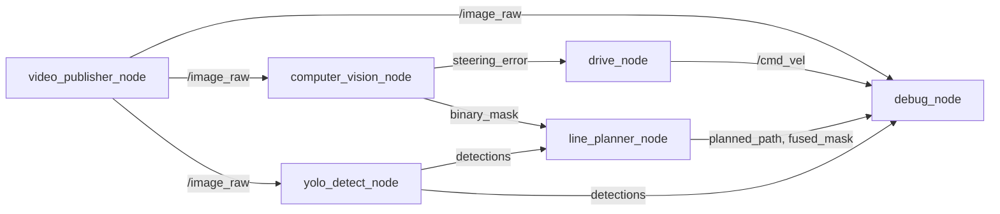

# 현재 ROS 노드 구성 평가 보고서

> 평가 스냅샷: 2026-07-24 19:17 KST  
> 범위: 실행 중인 `ros2_humble_ad` 컨테이너의 ROS 그래프, 현재 소스/설치 산출물, 저장된 빌드 로그를 읽기 전용으로 점검했다. 이 문서는 **폐쇄 트랙 데모 준비도**를 평가한 것이며, 실차·공도 안전 인증 평가는 아니다.

## 결론

**종합 점수: 55 / 100 — 조건부 데모 가능, 실차 운용 준비도는 부족**

카메라 → 차선 인지 → 조향 명령의 최소 폐루프는 실제로 연결되어 있고, 차선 검출기와 플래너에는 BEV·강건 피팅·YOLO ROI 보조 등 의미 있는 개선이 들어가 있다. 그러나 다음 세 가지가 전체 점수의 상한을 제한한다.

1. `drive_node`는 `/planned_path`가 아니라 단일 `/lane_detection/steering_error`만 사용한다. 즉, 플래너와 YOLO 융합 결과는 현재 제어에 반영되지 않는다.
2. 차선이 사라져도 이전 fit 또는 0 오차가 계속 나올 수 있는데, 이를 `drive_node`가 유효한 신호로 받아 0.35 m/s 명령을 낼 수 있다.
3. 실행 중인 YOLO는 `install/`의 구버전이며, 현재 `src/` YOLO 소스와 다르다. 최신 소스의 저지연 QoS·추론 지연 토픽은 라이브 그래프에 없다.

## 평가 대상과 실제 실행 상태

등록된 실행 노드는 7개이고, 이 중 6개가 현재 동작 중이다. `rqt_gui`는 관찰 도구이므로 채점에서 제외했다.

| 노드 | 상태 | 점수 | 판단 |
|---|---|---:|---|
| `video_publisher_node` | 실행 중 | **78** | 안정적인 영상 입력 역할은 수행하지만 QoS·CameraInfo·입력 진단이 부족하다. |
| `computer_vision_node` | 실행 중 | **68** | BEV/색상/에지/강건 fit/시간 평활화가 좋지만, 검출 유효성·confidence·fit 만료가 없다. |
| `yolo_detect_node` | 실행 중 | **45** | 검출 토픽은 동작하나 구버전 설치본·CPU 고부하·지연 계측 부재가 크다. |
| `line_planner_node` | 실행 중 | **62** | YOLO ROI 보조 융합과 path 생성은 동작하지만, path가 제어 입력으로 소비되지 않는다. |
| `drive_node` | 실행 중 | **48** | 20 Hz 명령과 0.5초 watchdog은 장점이나, 안전 인터록과 유효성 기반 정지가 없다. |
| `debug_node` | 실행 중 | **62** | HUD·composite 관측은 유용하지만 상태 판정이 카메라 프레임 유무에만 의존한다. |
| `opencv_line_detect_node` | 비활성 | **47** | 레거시 대체 경로다. downstream 소비자가 없고 Hough 기반 단순 검출이라 현 구성에서는 검증되지 않았다. |

## 현재 활성 데이터 흐름

중요한 사실은 `line_planner_node`의 `/planned_path` 구독자가 현재 `debug_node`뿐이라는 점이다. 차량 명령은 `computer_vision_node → drive_node` 직결 경로에서만 만들어진다. 따라서 현재의 YOLO 보조 융합은 HUD와 경로 표시에는 반영되지만, 조향 제어를 직접 개선하지는 않는다.

## 런타임 관측 근거

| 항목 | 관측값 | 해석 |
|---|---|---|
| 활성 ROS 노드 | 카메라, YOLO, CV, 플래너, 제어, 디버그의 6개 | 최소 폐루프와 관측 경로는 살아 있다. |
| `/cmd_vel` | 약 **20 Hz** | `drive_node`의 50 ms timer와 일치한다. |
| `/image_raw` | 짧은 관측 창에서 약 **1.4–4.7 Hz** | 입력 주기가 불안정하며, 제어 주기보다 훨씬 느리다. 정식 벤치마크가 필요하다. |
| `/yolo/detections` | 짧은 관측 창에서 약 **6.5–15.2 Hz** | 프레임/추론 부하에 따라 변동한다. |
| YOLO 프로세스 | 약 **618% CPU**, RSS 약 **862 MB** | 현재 스택의 가장 큰 자원 리스크다. |
| Debug 프로세스 | 약 **53% CPU**, RSS 약 **195 MB** | GUI와 30 Hz composite 렌더링 비용이 무시하기 어렵다. |
| `/planned_path` 샘플 | 설정 `sample_count=18` 대비 한 샘플에서 **5 poses** | 마스크가 희박할 때 path가 짧아질 수 있으며, 품질/유효성 신호가 필요하다. |

위 수치는 짧은 읽기 전용 관측값이다. 장시간 평균 지연·드롭률·99th percentile은 저장되지 않아 성능 합격 기준으로 사용하면 안 된다.

## 노드별 상세 평가

### 1. `video_publisher_node` — 78/100

`video_publisher_node.py`는 파일 존재 여부와 OpenCV capture 열기 실패를 처리하고, 네이티브 FPS 또는 지정 FPS로 프레임을 발행하며 종료 시 capture를 해제한다. 루프 재생과 ROS timestamp도 갖췄다.

- 장점: 파일/FPS 오류 처리, loop 재생, `camera_link` frame ID, 자원 해제.
- 감점: publisher QoS가 기본 Reliable depth 10이고 CameraInfo·프레임 드롭·입력 지연 진단이 없다. 파일 경로가 launch 기본값에 고정돼 있어 이식성이 낮다.

### 2. `computer_vision_node` — 68/100

`lane_detector.py`는 BEV 변환, HLS/HSV 색상 마스크, Canny edge 지지, 연결요소 필터, 2차 다항식의 residual 재-fit, 이전 fit의 지수 평활화를 수행한다. 이 구성은 단순 Hough 방식보다 곡선·반사 노이즈에 강한 편이다.

- 장점: 색상 단독보다 edge/컴포넌트 조건이 추가됐고, outlier와 프레임 간 흔들림을 줄이는 구조다.
- 핵심 위험: 픽셀이 부족하면 이전 fit을 제한 시간 없이 재사용하고, 한쪽/양쪽 차선이 없으면 중앙·0 heading을 반환한다. 그 결과 **"차선을 잃음"**이 아닌 정상 `Float32`가 계속 발행될 수 있다.
- 필요한 계약: `lane_valid`, confidence, fit age, timestamped diagnostic을 별도 토픽/메시지로 내보내고 controller가 이를 필수로 검사해야 한다.

### 3. `yolo_detect_node` — 45/100

라이브 프로세스는 `install/line_detection/.../yolo_detect_node.py`의 설치본을 사용한다. 이 구현은 OpenVINO GPU를 요청하되 실패 시 CPU fallback을 허용한다. 실제 워크스페이스에 설정된 OpenVINO IR 산출물이 확인되지 않았고, 높은 CPU 사용률도 CPU fallback 또는 CPU 병목 가능성을 뒷받침한다. GPU 사용 여부는 backend 로그/지연 계측으로 별도 확인해야 한다.

- 장점: `/yolo/detections`는 플래너와 HUD에 연결됐고, confidence·IoU·device가 파라미터화되어 있다.
- 감점: 기본 Reliable subscription(depth 10)과 동기 추론은 과거 프레임 적체 가능성이 있다. 실시간 설치본에는 latency 토픽이 없고, 높은 CPU 사용률이 카메라 주기에도 영향을 줄 수 있다.
- 배포 drift: 현재 `src/line_detection/.../yolo_detect_node.py`에는 BEST_EFFORT depth 1, `/yolo/inference_ms`, `/yolo/line_points`가 있지만 활성 노드는 이 토픽을 광고하지 않는다. 소스 개선이 아직 실행본에 반영되지 않았다는 뜻이다.

### 4. `line_planner_node` — 62/100

현재 플래너는 `/lane_detection/binary_mask`와 `/yolo/detections`를 구독하고, 신뢰도 0.50 이상·0.35초 이내의 YOLO box만 BEV ROI로 변환해 마스크를 보조한다. ROI가 lane mask와 충분히 겹치지 않으면 OpenCV mask로 fallback하며, 경로 중심점은 2차식으로 평활화한다.

- 장점: 시간 동기 허용치, confidence 임계값, 융합 실패 시 OpenCV fallback, `/planner/fused_mask` 관측이 있다.
- 감점: 좌표는 `bev_normalized`의 이미지 정규화 좌표로, 차량 좌표계/TF/실제 길이 단위 계약이 없다. 유효 점이 3개 미만이면 상태·빈 path·실패 사유를 발행하지 않는다.
- 가장 큰 구조 감점: 생성한 `/planned_path`는 controller가 쓰지 않는다. 현재는 **경로 계획 노드가 아니라 시각화용 경로 생성 노드**에 가깝다.

### 5. `drive_node` — 48/100

`drive_node.py`는 조향 오차를 받아 50 ms timer로 `/cmd_vel`을 발행한다. 0.5초 동안 새 오차가 없으면 기본 `Twist()`를 내므로 최소 watchdog은 있다. 적분과 조향 출력도 제한한다.

- 장점: 약 20 Hz의 고정 명령 주기, stale input timeout, integral/steering saturation.
- 감점: 고정 gain·고정 0.35 m/s, 가속도 제한, enable/deadman, E-stop, command mux, actuator ACK, 검출 confidence 검사, 경로 추종 입력이 없다.
- 안전상 결론: 메시지가 계속 들어오는 한 검출이 실제로 실패했어도 전진 명령이 유지될 수 있다. 이 노드를 실제 액추에이터에 직결하면 안 된다.

### 6. `debug_node` — 62/100

카메라/YOLO/BEV/마스크/path/조향/cmd_vel을 한 화면과 `/debug/composite_image`로 모아 관찰하기 좋다. 현재는 플래너의 `/planner/fused_mask`를 받아 융합 결과를 표시한다.

- 장점: 관측 범위가 넓고 path overlay·명령 telemetry가 있다.
- 감점: `TRACKING ACTIVE`는 단지 최근 카메라 프레임이 존재하는지로 정한다. stale lane·stale YOLO·0 path·controller timeout·명령 억제 상태를 구분하지 못한다. GUI 및 30 Hz composite는 현재 CPU 부하도 크다.

### 7. `opencv_line_detect_node` — 47/100, 비활성

BEV와 HSV/Hough 기반의 레거시 대체 노드다. 현재 ROS graph와 downstream 소비자에서 제외되어 있어 현 파이프라인의 성능에는 기여하지 않는다. 또한 edge와 color를 합친 `combined_mask`를 계산한 뒤 결과 마스크에 사용하지 않는 구현상 결함이 있어, 재활성화 전 정리가 필요하다.

## 시스템 항목별 점수

| 평가 항목 | 배점 | 점수 | 근거 |
|---|---:|---:|---|
| 기능 연결성 | 25 | 18 | 최소 제어 폐루프와 YOLO/플래너/HUD 연결이 동작한다. |
| 인지·경로 품질 | 20 | 13 | CV/플래너 품질은 개선됐지만 confidence·좌표계·경로 유효성 계약이 부족하다. |
| 실시간성 | 20 | 8 | 입력/YOLO 주기 변동과 CPU 병목이 크고, end-to-end latency 기록이 없다. |
| 제어·안전 | 25 | 9 | timeout은 있으나 검출 실패 감지·E-stop·명령 인터록·path tracking이 없다. |
| 운영·재현성 | 10 | 7 | HUD와 최근 성공 빌드는 있으나 통합 launch·자동 테스트·동일 실행본 보장이 부족하다. |
| **합계** | **100** | **55** | **폐쇄 트랙 데모 수준, 실차 투입 불가** |

## 우선순위 개선 목록

| 우선순위 | 조치 | 완료 판정 |
|---|---|---|
| P0 | `lane_valid`/confidence/age를 controller 입력으로 만들고 invalid·stale면 즉시 0 명령 | 차선 가림·YOLO 지연·카메라 정지 시험에서 지정 시간 이내 정지 |
| P0 | E-stop, enable/deadman, command mux, 가속도·속도 제한을 `/cmd_vel` 앞에 둔다 | 제어 노드 crash·토픽 단절·수동 정지 모두에서 안전 명령 확인 |
| P0 | 하나의 통합 launch로 6개 노드와 토픽 override를 고정하고, 현재 소스와 설치본을 같은 버전으로 배포한다 | 새 컨테이너에서 단일 명령으로 동일 graph/parameter 재현 |
| P1 | `/planned_path`를 실제 path tracker에 연결하거나, 현재처럼 direct steering 구조임을 명시하고 플래너를 제어 요구사항에서 제외한다 | controller가 path를 구독해 운전하거나, 아키텍처 문서와 graph가 일치 |
| P1 | YOLO backend·QoS·입력 크기를 확정하고 latency/drop/CPU/GPU를 기록한다 | 목표 FPS와 p95 end-to-end latency를 rosbag/metrics로 충족 |
| P2 | lane/YOLO/플래너/controller의 unit·replay·launch test와 diagnostics를 추가한다 | 정상·차선 소실·저조도·오탐·노드 재시작 시나리오 자동 통과 |

## 평가 한계

- 빌드 로그는 과거 build 성공/실패만 보여 주며, 현재 직접 실행한 CV·플래너·제어·디버그 소스의 전체 테스트를 대체하지 않는다.
- 실제 조향기, 차량 속도 피드백, E-stop 하드웨어, 센서 시간 동기, rosbag 기반 정량 정확도는 이번 읽기 전용 점검 범위 밖이다.
- 평가 중 소스/실행 구성이 갱신될 수 있으므로, 후속 수정 뒤에는 이 문서의 19:17 KST 스냅샷을 기준으로 재평가해야 한다.

## 수정 이력

### 2026-07-24 — P0-1: 차선 유효성 기반 제어 인터록 적용

- `computer_vision_node`가 `/lane_detection/lane_valid`(`std_msgs/Bool`)와 `/lane_detection/lane_confidence`(`std_msgs/Float32`)를 발행하도록 확장했다.
- 이전 프레임의 fit은 화면 평활화에만 사용할 수 있으며, 현재 프레임에서 좌·우 차선이 모두 관측되지 않으면 `lane_valid=false`, confidence `0.0`을 발행하도록 했다.
- `drive_node`가 `/lane_detection/lane_valid`를 필수 입력으로 구독하도록 변경했다. 유효 차선·신선한 조향 오차(기존 0.5초 watchdog)를 모두 만족할 때만 전진 명령을 생성하며, 그 외에는 `Twist()` 정지 명령을 20 Hz로 발행한다.
- 새 조향 오차를 수신할 때마다 controller는 `lane_valid=false`로 먼저 되돌리고, 뒤따르는 새 유효성 신호가 있을 때만 다시 전진을 허용한다. 토픽 간 상태 전환에서 이전 `true`가 남는 위험을 보수적으로 차단한다.
- 실행 검증에서 새 토픽의 광고·구독을 확인했다. `computer_vision_node`를 일시 중지한 차선 입력 단절 시험에서 `/cmd_vel`은 `linear.x=0.0`, `angular.z=0.0`으로 확인됐으며, 시험 후 인지 노드를 복구했다.

### 2026-07-24 — P0-2: enable/deadman 및 E-stop 소프트웨어 인터록 적용

- `drive_node`에 `/control/enable`과 `/control/emergency_stop`(`std_msgs/Bool`) 구독을 추가했다.
- 제어 enable은 기본 비활성이고, 0.5초 이내의 주기적 `true` 신호가 있어야 하는 deadman 방식이다. 차선 유효성·오차 신선성·enable·E-stop 해제 조건을 모두 충족할 때만 `/cmd_vel` 전진 명령을 만든다.
- `/control/emergency_stop=true` 수신 시 즉시 controller 상태를 초기화하고 정지 명령을 유지한다. E-stop 해제만으로는 재출발하지 않으며 새 deadman enable이 필요하다.
- `/control/active` 상태 토픽을 추가했다. 기본 상태에서 `false`와 0 속도 명령을 확인했고, E-stop 시험에서도 `/cmd_vel`의 선속도와 각속도가 모두 0임을 확인했다.
