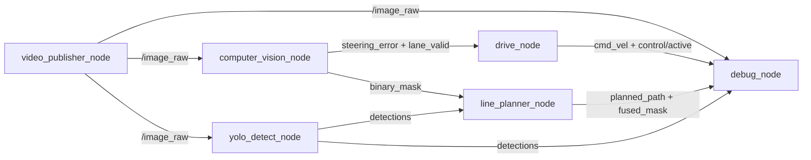

# 자율주행 파이프라인 다음 작업 및 재평가

> 파일명 기준 계획일: 2026-07-25  
> 검토 스냅샷: 2026-07-24, ROS 2 Humble 컨테이너 `ros2_humble_ad`  
> 범위: 실행 중 ROS graph, 현재 소스/설치 산출물, 빌드 로그를 읽기 전용으로 점검했다. 코드·설정은 변경하지 않았다.

## 이번 검토의 결론

**갱신 종합 점수: 60 / 100 — 기본 정지는 안전하지만, 실시간성·배포 재현성이 부족한 조건부 데모 프로토타입**

이전 평가 뒤 `computer_vision_node`의 `lane_valid`·`lane_confidence` 출력과 `drive_node`의 enable/deadman/E-stop 인터록이 추가됐다. 현재 라이브 graph에서도 이 토픽과 `/control/active`가 확인되며, enable publisher가 없는 기본 상태에서 `/control/active=false`, `/cmd_vel=0`인 것을 확인했다. 이 점은 분명한 개선이다.

하지만 계획 문서에는 다음 보정이 필요하다.

| 검토 항목 | 현재 판단 | 문서 반영 |
|---|---|---|
| 디스크 공간 | 현재 약 **48 GB** 여유. `0B` 전제는 더 이상 유효하지 않다. | “공간 확보” 대신 **하나의 canonical build/install/log 정규화**를 P0으로 변경. |
| 설치 산출물 | camera·YOLO는 `install/` 실행, CV·플래너·제어·HUD는 `src` 직접 실행이다. 여러 `build_*`/`install_*` 산출물도 존재한다. | 단일 설치본을 새로 검증하고 그것만 실행 기준으로 삼는다. |
| 통합 launch | 아직 없다. `line_planner/setup.py`도 launch 파일 설치를 선언하지 않아 문서의 launch 명령은 현 상태에서 성립하지 않는다. | launch 작성과 **패키지 data_files/의존성 정리**를 같은 P0 작업으로 묶는다. |
| HUD 상태 표시 | 현재 HUD는 `lane_valid`, `lane_confidence`, `/control/active`를 구독하지 않는다. `TRACKING ACTIVE`는 카메라 프레임 유무만 본다. | “제어 상태를 표시한다”는 서술을 수정하고 HUD health 표시를 P1로 올린다. |
| 안전 인터록 | 기본 정지·deadman·E-stop은 구현됐지만 confidence, validity freshness/순서, E-stop latch는 아직 보장하지 않는다. | 신호를 원자적으로 묶고, E-stop 경계를 강화하는 작업을 P0에 추가한다. |

## 현재 실행 구성



활성 노드는 `video_publisher_node`, `yolo_detect_node`, `computer_vision_node`, `line_planner_node`, `drive_node`, `debug_node`의 6개다. `opencv_line_detect_node`는 등록돼 있지만 비활성이고, `rqt_gui`는 관찰 도구라 평가에서 제외했다.

### 라이브 확인값

- `/control/enable`, `/control/emergency_stop`은 현재 publisher가 0개이며, 기본 상태는 `/control/active=false`, `/cmd_vel=0`이다.
- 짧은 샘플에서 `/lane_detection/lane_valid=true`가 확인됐지만, `/lane_detection/lane_confidence`는 **0.0–1.0**으로 변동했다. controller는 이 값을 아직 사용하지 않는다. YOLO는 `lane1`/`lane2`를 약 0.95 confidence로 검출했다.
- `/planned_path`는 샘플별 4–14개의 pose를 발행했다. 플래너의 YOLO ROI 융합·path 생성은 동작 중이지만, path validity 계약이 없음을 보여 준다.
- 짧은 관측에서 `/image_raw` 약 **2.74 Hz**, YOLO 약 **8.13 Hz**, mask 약 **15.04 Hz**, path 약 **7.92 Hz**, `/cmd_vel` 약 **19.98 Hz**가 관측됐다. 입력보다 후단 토픽이 빠른 것은 Reliable 큐의 과거 프레임 처리 가능성을 시사한다.
- YOLO는 약 **578% CPU**, RSS 약 **866 MB**로 현재 가장 큰 병목이다. 컨테이너 GPU 사용은 검증되지 않았고, Debug HUD도 약 38% CPU를 사용했다. 기존 `ros2 topic hz` 관찰 프로세스가 여러 개 남아 있어 이 수치는 정식 benchmark가 아니라는 점도 함께 기록한다.
- 최신 소스 변경 시각은 CV 19:22, drive 19:50이지만, 정규 `install/` 실행본에는 최신 YOLO 기능(`/yolo/inference_ms`, latest-frame QoS)이 반영되지 않았다.

## 최신 노드 평가

| 노드 | 상태 | 점수 | 근거와 다음 보완점 |
|---|---|---:|---|
| `video_publisher_node` | 실행 중 | **74** | 파일/FPS 오류 처리, loop, timestamp는 양호하다. 입력 주기 변동, CameraInfo, 명시 QoS, 지연 진단이 감점이다. |
| `computer_vision_node` | 실행 중 | **70** | BEV·색/에지·연결요소·강건 fit·시간 평활화에 `lane_valid/confidence`가 추가됐다. 단, confidence 변동과 별도 Bool·Float32의 순서·freshness 계약이 남는다. |
| `yolo_detect_node` | 실행 중 | **40** | lane1/lane2 검출과 플래너 ROI 보조는 확인됐다. 그러나 실행본은 구 설치본이고 CPU/RSS 병목·Reliable 입력 큐·latency 토픽 부재·GPU 미검증이 크다. |
| `line_planner_node` | 실행 중 | **60** | confidence 0.50, 0.35초 동기 허용치, OpenCV fallback, fused mask, 평활 path가 장점이다. invalid/짧은 path 상태를 발행하지 않고, path는 아직 controller에 쓰이지 않는다. |
| `drive_node` | 실행 중 | **66** | 20 Hz timer, 기본 정지, lane-valid, deadman, E-stop, output saturation이 개선점이다. confidence 미사용, 별도 토픽의 순서 문제, E-stop latch/하드웨어 경계 부재가 남는다. |
| `debug_node` | 실행 중 | **61** | YOLO·융합 마스크·BEV·path·`cmd_vel` telemetry는 표시한다. 그러나 control/lane health를 직접 보지 않아 상태 badge가 실제 안전 상태를 대변하지 못한다. |
| `opencv_line_detect_node` | 비활성 | **42** | Hough 기반 레거시 경로이며 downstream consumer가 없다. 재활성화 전에는 edge-mask 처리와 인터페이스를 정리해야 한다. |

### 시스템 점수 산정

| 항목 | 배점 | 점수 | 판단 |
|---|---:|---:|---|
| 기능 연결성 | 25 | 20 | 6개 노드 graph와 경로 생성, 기본 안전 정지가 확인됐다. |
| 인지·경로 품질 | 20 | 14 | CV·YOLO ROI 융합은 개선됐으나 confidence 변동, calibration·path validity·좌표계 계약이 없다. |
| 실시간성 | 20 | 6 | YOLO CPU 병목, 느린 입력, Reliable 큐 적체 가능성, p95 증거 부재가 크다. |
| 제어·안전 | 25 | 14 | 기본 정지/인터록은 추가됐지만 confidence·message atomicity·latch·actuator safety가 부족하다. |
| 배포·검증 | 10 | 6 | 일부 빌드 성공 이력은 있으나 canonical install, 통합 launch, 자동 테스트가 없다. |
| **합계** | **100** | **60** | **폐쇄 트랙 데모는 가능하나, 실차 투입 전 P0 완료가 필수** |

## 우선순위 작업

### P0-1. 하나의 canonical 설치본과 통합 launch를 만든다

디스크 정리는 현재 선행 조건이 아니다. 여러 `build_*`/`install_*` overlay가 소스와 런타임의 drift를 만들고 있으므로, 보존할 산출물을 확인한 뒤 **하나의** `build/`, `install/`, `log/`만 실행 기준으로 재생성·검증한다. 과거에는 stale egg-info/기존 editable install로 build가 실패한 적이 있으나, 이후 별도 fresh 경로의 `--symlink-install` build는 성공했다. 따라서 전면적인 Docker prune보다 canonical build 검증이 우선이다.

통합 launch 작업에는 아래 패키징 보완을 포함한다.

- `line_planner`(또는 통합 launch를 소유할 패키지)의 `setup.py`에 `launch/*.launch.py` 설치 항목을 추가한다.
- `line_detection`의 HUD가 사용하는 `nav_msgs` 등 실제 의존성을 `package.xml`에 선언한다.
- camera/YOLO의 `/image_raw`, CV/debug/YAML의 `/camera/image_raw` 기본값을 하나로 통일하거나, 통합 launch에서 모든 topic override를 명시한다.
- `debug.launch.py`의 노드명 `debug_visualization_node`와 실제 `/debug_node`의 이름 정책도 하나로 고정한다.

완료 판정:

```bash
ros2 launch line_planner autonomy_pipeline.launch.py
```

한 명령으로 6개 노드, `lane_valid`, `lane_confidence`, `/control/*`, `/planner/fused_mask`까지 같은 graph와 parameter로 재현되고, 각 실행 파일이 `ros2 pkg executables`에 표시된다.

### P0-2. 안전 신호를 원자화하고 E-stop 경계를 강화한다

현재 `steering_error`와 `lane_valid`는 서로 다른 header 없는 토픽이다. callback 순서가 바뀌면 과거 valid가 새 error를 잠시 허용할 수 있고, `lane_confidence`는 controller가 아직 사용하지 않는다.

- header/sequence/age를 가진 단일 `LaneEstimate`(조향 오차·valid·confidence를 함께 포함) 계약을 만든다.
- controller에 최소 confidence와 estimate freshness를 파라미터로 넣고, 조건 미달이면 즉시 정지한다.
- E-stop callback에서 zero command를 즉시 발행하거나, 완료 기준을 timer 포함 측정 상한으로 명시한다.
- volatile Bool 한 번 발행에만 의존하지 않도록 latched/heartbeat E-stop, command mux, actuator watchdog 또는 하드웨어 E-stop 경계를 정의한다.

완료 판정: controller 재시작·토픽 순서 역전·저 confidence·lane invalid·입력 단절에서도 전진 명령이 나오지 않는다.

### P0-3. 안전 인터록 시험을 자동화한다

현재 기본 정지는 확인했지만, 주행 enable을 실제로 인가하는 시험은 수행하지 않았다. 아래 항목을 `launch_testing` 또는 rosbag replay 기반 자동 시험으로 만든다.

1. enable 미발행 시 `/cmd_vel=0`, `/control/active=false`
2. CV 중지 또는 steering estimate timeout 시 지정 deadline 안에 정지
3. `lane_valid=false`, low confidence, stale estimate, out-of-order validity에서 정지
4. 주행 중 E-stop에서 zero command, controller 재시작 뒤에도 의도치 않은 재출발 없음
5. enable 중지(deadman timeout)와 E-stop 해제만으로는 재출발하지 않음

### P0-4. YOLO backend·QoS·큐 적체를 먼저 정리한다

현재 설치 실행본은 OpenVINO/GPU 요청 및 CPU fallback 경로이고, 최신 `src` YOLO는 BEST_EFFORT depth 1과 latency 토픽을 추가했지만 기본 device가 CPU다. 어느 쪽을 배포 기준으로 쓸지 먼저 결정해야 한다.

- `road_best.pt`의 backend(CPU/OpenVINO/CUDA), image size, QoS를 문서와 launch에 고정한다.
- `/yolo/inference_ms` 또는 동등한 metric, 입력 FPS, detection FPS, CPU/RSS, GPU, end-to-end p95 latency를 기록한다.
- camera/CV/YOLO의 image QoS와 queue depth를 한 표로 고정하고, 입력보다 후단 처리율이 높을 때 과거 프레임이 쌓이지 않는지 rosbag timestamp로 검증한다.
- 남아 있는 장기 `ros2 topic hz` 관찰 프로세스는 별도 관찰 세션으로 관리해 실제 성능 측정과 분리한다.
- model class(`lane1`, `lane2`)와 planner의 `lane_classes`가 배포 모델과 일치하는지 startup test로 검증한다.

### P1-1. path validity 계약을 먼저 만들고 path tracker를 연결한다

현재 플래너는 3개 미만 중심점이면 아무 메시지도 발행하지 않는다. tracker 전환 전에 매 mask마다 `path_valid`, failure reason, header freshness를 발행하거나 명시적으로 빈 `Path`를 발행해야 한다.

그 다음에 `bev_normalized`를 차량 좌표/길이 단위/TF로 정의하고 Pure Pursuit 또는 Stanley tracker를 적용한다. 현재 `/planned_path`의 유일한 소비자는 debug node이므로, tracker가 실제로 이를 구독하기 전에는 플래너 성능이 조향에 반영되지 않는다.

### P1-2. HUD를 실제 health 상태에 맞춘다

HUD는 다음을 구독하고 freshness를 표시해야 한다.

- `/lane_detection/lane_valid`, `/lane_detection/lane_confidence`
- `/control/active`, `/control/enable`, `/control/emergency_stop`
- `/planned_path` pose 수·freshness·`path_valid`
- YOLO detection·latency freshness

`TRACKING ACTIVE`는 카메라 수신만이 아니라 위 조건이 모두 만족될 때만 표시하고, 정지 이유를 화면에 명시한다.

### P2. calibration·의존성·테스트 범위를 정리한다

- CV와 planner에 중복된 BEV source/destination point를 하나의 calibration 파일로 관리하고 replay test로 검증한다.
- OpenCV/NumPy/Ultralytics 및 ROS message 의존성을 이미지·package manifest·빌드 가이드에 명시한다.
- legacy `opencv_line_detect_node`를 제거하거나, 지원 경로라면 동일한 validity/diagnostic 계약으로 맞춘다.
- 정상·차선 소실·저조도·오탐·노드 재시작 영상에 대한 replay/unit/launch test를 추가한다.

## 재시작 전 확인 명령

```bash
docker ps --filter name=ros2_humble_ad
docker exec ros2_humble_ad bash -lc 'source /opt/ros/humble/setup.bash; ros2 node list'
docker exec ros2_humble_ad bash -lc 'source /opt/ros/humble/setup.bash; ros2 topic list -t'
docker exec ros2_humble_ad bash -lc 'source /opt/ros/humble/setup.bash; ros2 topic info --verbose /control/active'
```

확인할 핵심 노드:

- `/video_publisher_node`
- `/yolo_detect_node`
- `/computer_vision_node`
- `/line_planner_node`
- `/drive_node`
- `/debug_node`

## 참고 문서

- [현재 노드 평가](CURRENT_NODE_EVALUATION_2026-07-24.md)
- [기존 개선 이력](NODE_EVALUATION_REPORT.md)
- [프로젝트 실행 가이드](../AGENTS.md)
