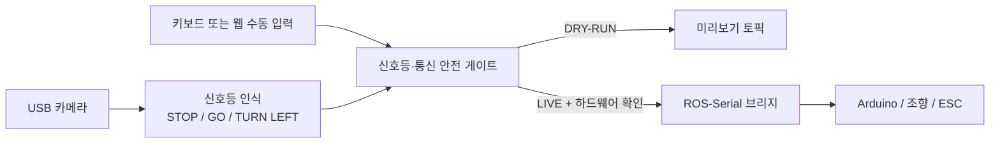

# KHU Dolsoe: 신호등 인식 + 수동 주행

이거 바닥에서 띄워서 하라는데 그냥 내려놓고 부딪힐 거 같다 그러면 x 눌러서 정지하면 됩니다. 생각보다 안 빨라요. 근데 방심은 하면 안됩니다ㅏ..
 
2026-07-29 기준으로 작업한 ROS 2 신호등 인식, 카메라 안전 게이트 수동 주행,
Arduino 직렬 브리지와 실행 도구를 한 저장소로 정리한 스냅샷입니다.

## 노트북과 Jetson 작업 구분

- `laptop/ros2_ws`: 개인 노트북·WSL에서 개발하고 소프트웨어 검증한 워크스페이스
- `laptop/windows_launchers`: 노트북에서 카메라 시험과 Jetson 원격 실행을 여는 도구
- `jetson`: 실제 Jetson에서 가져온 워크스페이스를 별도로 제출할 영역

현재 포함된 ROS 2 소스는 노트북 워크스페이스 스냅샷입니다. Jetson의
`/root/ros2_ws` 또는 `/home/sandi/ros2_ws`는 이 소스와 로직이 같더라도 실제
장비에서 가져온 버전과 검증 기록을 `jetson/` 아래에 별도로 관리합니다.

## Issue #10 / 슬롯 B 수행 현황

### 담당 및 완료 범위

- 담당: **Issue #10 / 슬롯 B — Jetson·차량 수동주행 기준선**
- 완료: 기존 수동주행 코드 실행, 전후진 모터·좌우 조향 명령 전달, 안전한 중립 종료 절차
- 완료: 브라우저 수동주행 DRY-RUN 안전 게이트
  - 안전 확인 후 ARM
  - 0.25초 heartbeat 단절 시 `throttle=0` 및 ARM 해제
  - 비상정지 시 `operator_estop`
  - 실차 승인 파일이 없으면 비영(非零) 물리 출력을 차단

### 실행 환경과 실행 명령

- 노트북: Windows PowerShell, SSH 별칭 `jetson-car`
- 차량 컴퓨터: Jetson Orin Nano, Ubuntu 22.04, Docker 컨테이너 `sanditest`
- 소프트웨어: ROS 2 Humble, Python 3.10
- 제어기: Arduino Uno, 고정 장치 경로
  `/dev/serial/by-id/usb-Arduino__www.arduino.cc__0043_5583832383535181C1B0-if00`

빌드와 테스트:

```bash
cd /root/ros2_ws
source /opt/ros/humble/install/setup.bash
PYTHONNOUSERSITE=1 colcon build --symlink-install \
  --packages-select kmu_track rc_car_teleop laptop_teleop
source install/setup.bash
colcon test --packages-select kmu_track rc_car_teleop laptop_teleop
colcon test-result --verbose
```

기존 실차 수동주행:

```powershell
ssh -tt jetson-car "docker exec -it sanditest bash /root/ros2_ws/src/laptop_teleop/scripts/container_existing_manual.sh"
```

- `W`/`S`: 전진·후진
- `A`/`D`: 좌·우 조향
- `Space`: 속도 정지
- `C`: 조향 중앙
- `X`: 전체 정지
- `Q` 또는 `Ctrl+C`: 중립 명령 전송 후 안전 종료

모터 출력이 없는 DRY-RUN:

```powershell
ssh jetson-car "bash /home/sandi/ros2_ws/src/laptop_teleop/scripts/start_dry_run_detached.sh"
```

브라우저에서 `http://<JETSON_IP>:8765`를 열어 조작합니다. 종료 명령은 다음과 같습니다.

```powershell
ssh jetson-car "bash /home/sandi/ros2_ws/src/laptop_teleop/scripts/stop_dry_run.sh"
```

### 확인한 테스트 결과

2026-07-29 WSL Ubuntu 22.04 / ROS 2 Humble에서 확인한 결과입니다.

```text
Build: 3 packages finished
kmu_track: 37 passed
rc_car_teleop: 3 passed
laptop_teleop: 5 passed
Summary: 45 tests, 0 errors, 0 failures, 0 skipped
```

추가로 다음을 확인했습니다.

- DRY-RUN에서 ARM 후 명령 전달, heartbeat 단절 시 `throttle=0`과 ARM 해제
- 브라우저 비상정지 후 정지 사유 `operator_estop`
- 기존 수동주행 실행 시 Arduino 시리얼 연결, 초기 `/rc_car/drive_cmd=[0, 0]`,
  Arduino 피드백 `throttle=0`
- Arduino Uno용 조정 펌웨어 컴파일 성공: 프로그램 저장공간 23%, RAM 20%
- 조정 펌웨어 업로드는 `avrdude: stk500_getsync()` 오류로 아직 성공하지 못함

### 실제 차량에서 확인된 범위

- 기존 `rc_car_teleop` 기준선으로 저속 수동주행을 실행해 전후진 모터와 좌·우 조향을 확인함
- Jetson → ROS 2 토픽 → USB 시리얼 → Arduino로 이어지는 명령 경로와 중립 시작·종료를 확인함
- 새 브라우저 DRY-RUN 게이트는 물리 모터를 구동하지 않는 범위에서 확인함
- 물리 비상정지, 모든 timeout 계층, 조정 펌웨어의 최대 전후진 출력은 아직 실차 완료로
  간주하지 않음

### 아직 안 된 것

- 라바콘 회피
- 차선 자율주행
- 국민대 실제 트랙 시험

### 필요한 장비 시험

1. Arduino Uno의 RESET 타이밍을 맞춰 조정 펌웨어를 업로드하고 실제 펌웨어 버전을 확인합니다.
2. 차량 스탠드로 구동 바퀴를 띄운 뒤 조향 좌·중앙·우 방향과 ADC 끝값, ESC 중립,
   저속 전진·후진을 각각 따로 시험합니다.
3. `X` 정지, 2초 운전자 deadman, 브라우저 0.25초 heartbeat, ROS 0.30초 command
   timeout, Arduino 0.40초 watchdog을 순서대로 끊어 중립 출력을 확인합니다.
4. 소프트웨어 정지와 별개인 물리 구동 전원 차단 스위치를 준비하고 실제 차단을 확인합니다.
5. 평지에서 보행 속도 이하의 1–5 m 직선 주행으로 정지거리, 조향 복귀, 배터리 전압,
   ESC·커넥터 발열을 확인합니다.
6. 안전요원과 물리 비상정지 담당자를 배치한 뒤 라바콘 구간, 차선 구간, 국민대 트랙
   순서로 시험 범위를 넓힙니다.

필요 장비는 차량 스탠드, 물리 전원 차단기, 멀티미터, 데이터 USB 케이블, 충전된 배터리와
충전기, 라바콘·차선 표시재, 현장 안전요원입니다.

## 핵심 구조



- `laptop/ros2_ws/src/kmu_track`: HSV 신호등 인식, 좌회전 화살표 판별, 안전 모터 게이트
- `laptop/ros2_ws/src/rc_car_teleop`: 키보드 수동 주행, Arduino USB 직렬 브리지
- `laptop/ros2_ws/src/laptop_teleop`: 웹 수동 주행, 단일 운전자·heartbeat 안전 로직, 펌웨어
- `laptop/windows_launchers`: Windows에서 카메라 시험·Jetson 실행·DRY-RUN을 여는 스크립트
- `docs/신호등_수동주행_로직_정리.md`: 전체 알고리즘과 토픽·파라미터 정리
- `docs/guides`: 기존 수동 주행 HTML 안내서

## ROS 2 빌드

Ubuntu 22.04와 ROS 2 Humble 기준입니다.

```bash
cd laptop/ros2_ws
source /opt/ros/humble/setup.bash
PYTHONNOUSERSITE=1 colcon build --symlink-install \
  --packages-select kmu_track rc_car_teleop laptop_teleop
source install/setup.bash
```

## 가장 안전한 실행: 카메라 + 수동 주행 DRY-RUN

```bash
ros2 launch kmu_track traffic_manual_drive.launch.py \
  motor_dry_run:=true \
  hardware_confirmed:=false \
  camera_device:=/dev/video0
```

- 수동 조작 화면: `http://127.0.0.1:8765`
- 신호등·최종 명령 미리보기: `http://127.0.0.1:8080`
- DRY-RUN 출력 토픽: `/rc_car/drive_cmd_preview`

Windows 카메라 단독 시험은
`laptop/windows_launchers/camera_traffic_light_test.cmd`를 실행합니다.

## 실차 실행 전 필수 확인

이 저장소의 기본값은 모터 출력을 막는 DRY-RUN입니다. 실차 출력은 다음을 모두
확인한 뒤에만 허용해야 합니다.

1. 바퀴를 지면에서 띄우고 물리 모터 전원 차단 수단을 준비합니다.
2. 카메라 ROI와 빨강·초록 임계값을 실제 트랙 영상으로 다시 보정합니다.
3. Arduino 포트, 조향 방향, 중립값, LOW 기어와 watchdog을 확인합니다.
4. `motor_dry_run:=false`와 `hardware_confirmed:=true`를 동시에 지정합니다.

실제 장비에서 만든 `hardware_confirmed.env`는 PC·차량별 상태이므로 Git과 ZIP에
포함하지 않습니다. `laptop/ros2_ws/src/laptop_teleop/config/hardware_confirmed.env.example`
을 복사한 뒤 현장에서 다시 확인해 사용하십시오.

## 문서

- [신호등·수동 주행 로직 정리](docs/신호등_수동주행_로직_정리.md)
- [패키지 구성표](docs/PACKAGE_MANIFEST.md)
- [검증 결과](docs/VALIDATION.md)
- [노트북 수동 주행 실행 가이드](docs/guides/노트북_수동주행_실행가이드.html)
- [100 m 첫 랩 가이드](docs/guides/수동주행_100m_첫랩_가이드.html)

## 현재 스냅샷 검증 결과

WSL Ubuntu 22.04 / ROS 2 Humble에서 패키지 3개를 다시 빌드하고 테스트했습니다.

```text
Summary: 3 packages finished
Summary: 45 tests, 0 errors, 0 failures, 0 skipped
```

위 45개 테스트는 소프트웨어 검증입니다. 실제 차량 확인 범위는 앞의 Issue #10 항목에
적은 수동주행 기준선으로 제한되며, 영상 임계값과 미완료 물리 안전 항목은 현장 절차를
거쳐 별도로 확인해야 합니다.
