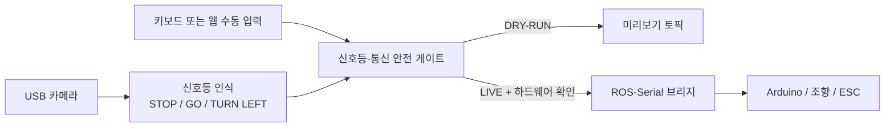

# KHU Dolsoe: 신호등 인식 + 수동 주행

2026-07-29 기준으로 작업한 ROS 2 신호등 인식, 카메라 안전 게이트 수동 주행,
Arduino 직렬 브리지와 실행 도구를 한 저장소로 정리한 스냅샷입니다.

## 핵심 구조



- `ros2_ws/src/kmu_track`: HSV 신호등 인식, 좌회전 화살표 판별, 안전 모터 게이트
- `ros2_ws/src/rc_car_teleop`: 키보드 수동 주행, Arduino USB 직렬 브리지
- `ros2_ws/src/laptop_teleop`: 웹 수동 주행, 단일 운전자·heartbeat 안전 로직, 펌웨어
- `windows_launchers`: Windows에서 카메라 시험·Jetson 실행·DRY-RUN을 여는 스크립트
- `docs/신호등_수동주행_로직_정리.md`: 전체 알고리즘과 토픽·파라미터 정리
- `docs/guides`: 기존 수동 주행 HTML 안내서

## ROS 2 빌드

Ubuntu 22.04와 ROS 2 Humble 기준입니다.

```bash
cd ros2_ws
source /opt/ros/humble/setup.bash
PYTHONNOUSERSITE=1 colcon build --symlink-install \
  --packages-select kmu_track rc_car_teleop laptop_teleop
source install/setup.bash
```

## 가장 안전한 실행: 카메라 + 수동 주행 DRY-RUN

```bash
ros2 launch kmu_track traffic_manual_drive.launch.py \
  motor_dry_run:=true \
  hardware_confirmed:=false \
  camera_device:=/dev/video0
```

- 수동 조작 화면: `http://127.0.0.1:8765`
- 신호등·최종 명령 미리보기: `http://127.0.0.1:8080`
- DRY-RUN 출력 토픽: `/rc_car/drive_cmd_preview`

Windows 카메라 단독 시험은
`windows_launchers/camera_traffic_light_test.cmd`를 실행합니다.

## 실차 실행 전 필수 확인

이 저장소의 기본값은 모터 출력을 막는 DRY-RUN입니다. 실차 출력은 다음을 모두
확인한 뒤에만 허용해야 합니다.

1. 바퀴를 지면에서 띄우고 물리 모터 전원 차단 수단을 준비합니다.
2. 카메라 ROI와 빨강·초록 임계값을 실제 트랙 영상으로 다시 보정합니다.
3. Arduino 포트, 조향 방향, 중립값, LOW 기어와 watchdog을 확인합니다.
4. `motor_dry_run:=false`와 `hardware_confirmed:=true`를 동시에 지정합니다.

실제 장비에서 만든 `hardware_confirmed.env`는 PC·차량별 상태이므로 Git과 ZIP에
포함하지 않습니다. `ros2_ws/src/laptop_teleop/config/hardware_confirmed.env.example`
을 복사한 뒤 현장에서 다시 확인해 사용하십시오.

## 문서

- [신호등·수동 주행 로직 정리](docs/신호등_수동주행_로직_정리.md)
- [패키지 구성표](docs/PACKAGE_MANIFEST.md)
- [검증 결과](docs/VALIDATION.md)
- [노트북 수동 주행 실행 가이드](docs/guides/노트북_수동주행_실행가이드.html)
- [100 m 첫 랩 가이드](docs/guides/수동주행_100m_첫랩_가이드.html)

## 현재 스냅샷 검증 결과

WSL Ubuntu 22.04 / ROS 2 Humble에서 패키지 3개를 다시 빌드하고 테스트했습니다.

```text
Summary: 3 packages finished
Summary: 45 tests, 0 errors, 0 failures, 0 skipped
```

실제 카메라·Arduino·ESC를 연결한 실차 검증 결과는 아닙니다. 영상 임계값과 물리
출력은 현장 안전 절차를 거쳐 별도로 확인해야 합니다.
