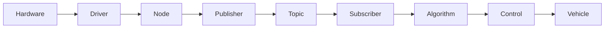

# ROS2 자율주행 디버깅 및 개발 가이드라인

본 문서는 ROS2 기반 자율주행 시스템 개발 및 디버깅 시 준수해야 하는 기본 원칙과 가이드라인을 정의합니다.

---

## 1. 답변 구성 순서

ROS2 자율주행 관련 문제 발생 시 답변은 다음 순서를 엄격히 준수하여 제공합니다.

1. **원인**: 문제 발생 원인 분석 및 설명
2. **확인 명령**: 문제 상황을 파악하고 상태를 점검하기 위한 즉시 실행 가능한 명령어
3. **예상 결과**: 확인 명령어 실행 시 기대되는 정상/이상 출력 결과
4. **조치**: 문제 해결을 위한 단계별 조치 및 수정 사항

---

## 2. 디버깅 계층 구조

디버깅은 아래의 계층 순서에 따라 단계별로 점검합니다.

$$\text{Hardware} \rightarrow \text{Driver} \rightarrow \text{Node} \rightarrow \text{Publisher} \rightarrow \text{Topic} \rightarrow \text{Subscriber} \rightarrow \text{Algorithm} \rightarrow \text{Control} \rightarrow \text{Vehicle}$$

1. **Hardware**: 물리적 연결, 전원, 통신 포트 (USB, CAN, Ethernet 등) 점검
2. **Driver**: 센서/액추에이터 드라이버 노드 실행 여부 및 장치 인식 점검
3. **Node**: ROS2 노드가 정상적으로 등록되어 활성화되었는지 확인
4. **Publisher**: 노드가 데이터를 정상적으로 발행(Publish)하고 있는지 확인
5. **Topic**: 토픽 데이터의 형식, 통신 상태, 데이터 파이프라인 연결 확인
6. **Subscriber**: 수신 노드가 토픽을 정상적으로 구독(Subscribe)하고 있는지 확인
7. **Algorithm**: 인지/판단/경로생성 등 내부 로직 및 데이터 처리 점검
8. **Control**: 제어 명령어 생성 및 액추에이터 대상 목표값 계산 점검
9. **Vehicle**: 차량 실제 동작 및 반응 점검 (실차 검증)

---

## 3. 원칙 및 개발 규칙

### 명령어 및 환경
- **실행 가능성**: 모든 명령어는 현재 환경에서 바로 복사하여 실행할 수 있는 명확한 형태로 제시합니다.
- **기본 환경**: **ROS2 Humble** + **Python (`rclpy`)** 환경을 우선으로 적용합니다.
- **ROS2 기본 CLI 도구 우선 활용**:
  - 노드 목록 확인: `ros2 node list`
  - 토픽 목록 확인: `ros2 topic list`
  - 토픽 세부 정보(QoS/연결 노드): `ros2 topic info -v <topic_name>`
  - 토픽 데이터 확인: `ros2 topic echo <topic_name>`
  - 토픽 주기/주파수 확인: `ros2 topic hz <topic_name>`
- **빌드 위치**: `colcon build`는 항상 워크스페이스 루트(`ros2_ws`)에서 실행합니다.

### 코드 및 버전 관리 (Git Workflow)
- **소스 중심 공유**: Laptop과 Jetson 간에는 `src/` 내 소스 코드 중심으로 Git을 통해 공유합니다.
- **Git Ignore**: 빌드 및 로그 산출물 (`build/`, `install/`, `log/`)은 Git 추적에서 제외합니다.
- **최소 수정 원칙**: 기존 코드는 필요 최소한으로 수정하여 부작용을 방지합니다.
- **추측 금지**: 명시되지 않은 토픽명, 센서 종류, 알고리즘 구조는 임의로 추측하지 않습니다.

### 검증 프로세스 (Deployment Flow)
1. **Laptop 검증**: Laptop 개발 환경에서 기능 구현 및 시뮬레이션/단체 검증 진행
2. **Git Push**: Laptop에서 작업 완료 후 원격 리포지토리에 push
3. **Jetson Pull**: Jetson 타깃 장비에서 최신 소스 pull
4. **Jetson 재빌드**: Jetson의 `ros2_ws` 루트에서 `colcon build --symlink-install` 실행
5. **실차 검증**: 실제 차량에 탑재하여 하드웨어 통합 동작 검증

---
