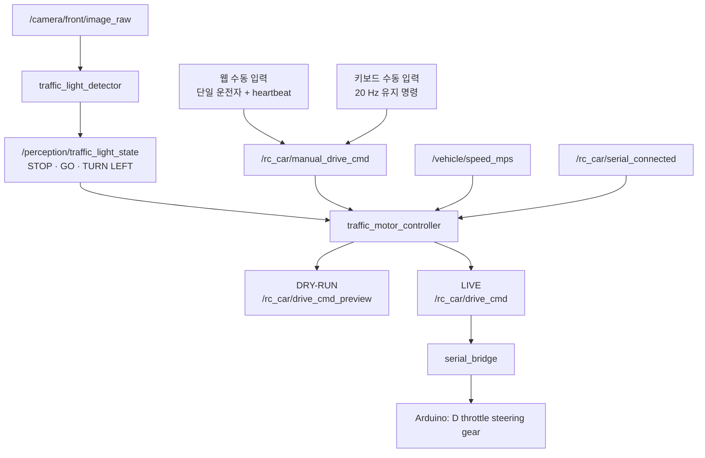

# 신호등 인식과 수동 주행 알고리즘 정리

정리 기준일: 2026-07-29

이 문서는 현재 소스의 실제 동작을 기준으로 작성했습니다. 목표는 카메라 신호가
허용할 때만 운전자의 수동 명령을 차량으로 보내고, 영상·수동 입력·USB 직렬 중
하나라도 끊기면 중립으로 돌아가는 것입니다.

## 1. 전체 데이터 흐름



## 2. 신호등 인식

구현 파일:

- `kmu_track/traffic_light_core.py`: ROS와 분리된 영상 처리·상태 필터
- `kmu_track/traffic_light_node.py`: ROS Image 입력과 토픽 출력
- `config/perception.yaml`: 실제 사용하는 기본 임계값

### 2.1 ROI와 HSV 마스크

프레임 전체를 검사하지 않고 정규화 좌표 `[x, y, width, height]`로 지정한 ROI만
검사합니다. 현재 시작 신호와 좌회전 신호 ROI는 모두
`[0.35, 0.05, 0.30, 0.30]`입니다.

1. BGR 영상을 HSV로 변환합니다.
2. 빨강은 Hue가 경계에서 이어지므로 `0..12`와 `165..180` 두 범위를 합칩니다.
3. 초록은 `35..100` 범위를 사용합니다.
4. 타원형 커널로 열림·닫힘 연산을 수행해 작은 잡음을 제거합니다.
5. ROI 안 색상 픽셀 비율과 가장 큰 외곽선 면적을 함께 검사합니다.

현재 설정에서 빨강·초록은 색상 비율이 `0.02` 이상이고 최대 블롭 면적이
`50 px²` 이상이어야 유효합니다. 비율만 높고 연결된 빛 영역이 작으면 신호로
인정하지 않습니다.

### 2.2 빨강과 초록이 동시에 보일 때

- 초록 비율이 더 크면 초록 후보입니다.
- 빨강 비율이 더 크면 빨강 후보입니다.
- 비율이 같으면 즉시 안전 상태인 `STOP`입니다.

즉, 작은 반사광은 더 큰 실제 신호가 이기도록 하되 애매한 동률은 주행 허가로
사용하지 않습니다.

### 2.3 좌회전 화살표

초록 블롭을 찾은 뒤 두 종류의 형상을 지원합니다.

- 채워진 화살표: 가로세로비, 오목함(solidity), 왼쪽 끝점 위치,
  오른쪽 픽셀 질량을 조합합니다.
- 분리된 선 화살표: `<` 모양 머리와 오른쪽 수평 막대를 각각 찾아 정렬 상태를
  검사합니다.

현재 기준은 최소 가로세로비 `1.20`, 최대 solidity `0.90`,
오른쪽/왼쪽 질량비 `1.20`입니다. 오른쪽 화살표가 좌회전으로 오인되지 않도록
방향 특징도 검사합니다.

### 2.4 연속 프레임 필터와 상태

원시 검출 한 프레임만으로 움직이지 않습니다.

- 빨강: 5프레임 연속 확인 후 `STOP`
- 초록 또는 좌회전: 같은 후보를 5프레임 연속 확인 후 `GO` 또는 `TURN LEFT`
- 신호 없음: 현재 설정은 1프레임에서 `STOP`
- 시작 신호: 빨강을 먼저 본 뒤에만 초록을 주행 허가로 인정
- 좌회전 신호: 빨강 선행 조건 없음

ROS 노드는 시작용 검출기와 좌회전용 검출기를 따로 실행합니다. 좌회전 검출기가
`TURN LEFT`이면 이를 최종 상태로 우선하고, 그렇지 않으면 시작 검출기 상태를
발행합니다.

## 3. 수동 입력

### 3.1 키보드 입력

`rc_car_teleop/keyboard_teleop.py`는 20 Hz로
`[throttle, steering, gear]`를 발행합니다.

| 키 | 동작 |
|---|---|
| `W` / `S` | throttle을 150씩 증가 / 감소 |
| `A` / `D` | steering을 150씩 좌 / 우 변경 |
| `1` / `2` | LOW(-1) / HIGH(1) 기어 |
| `Space` | throttle만 0 |
| `C` | steering만 0 |
| `X` | throttle과 steering 모두 0 |
| `Q` / `Ctrl-C` | 중립 명령 3회 전송 후 종료 |

키보드 값은 다음 키를 누를 때까지 유지됩니다. 따라서 이 방식은 키를 놓으면
멈추는 dead-man 방식이 아니며, 카메라 안전 게이트·종료 중립 명령·Arduino
watchdog과 함께 사용해야 합니다.

### 3.2 웹 입력

`laptop_teleop/control_core.py`와 `web_teleop.py`는 다음 보호를 추가합니다.

- 한 번에 한 IP만 운전자 권한을 가집니다.
- LIVE 모드는 `/rc_car/serial_connected=true`일 때만 ARM됩니다.
- 브라우저 명령 heartbeat가 0.25초 넘게 끊기면 ARM을 해제하고 `[0, 0]`으로
  돌아갑니다.
- 잘못된 값은 중립 정지시키고, 정상 값도 throttle `-1000..1050`,
  steering `-1000..1000`으로 제한합니다.
- E-stop과 노드 종료 시 중립 명령을 3회 발행합니다.

## 4. 신호등·수동 명령 안전 게이트

`TrafficMotorController`가 다음 순서로 최종 명령을 결정합니다.

1. `enabled=false`이면 출력하지 않습니다.
2. LIVE에서 직렬 연결이 없으면 `serial_not_ready` 중립입니다.
3. 직렬 연결 직후 1.0초 동안 `serial_arming_neutral` 중립을 유지합니다.
4. 신호등 상태가 0.50초보다 오래되면 `signal_stale` 중립입니다.
5. 수동 모드에서 운전자 명령이 0.50초보다 오래되면
   `manual_command_stale` 중립입니다.
6. 신호 상태에 따라 아래 명령을 만듭니다.

| 신호 | throttle | steering | 핵심 동작 |
|---|---:|---:|---|
| `STOP` | 즉시 0 | 정지 확인 전 기존 조향 유지 | 속도 `≤0.03 m/s` 또는 0.75초 후 중앙 |
| `GO` | 운전자 값 | 운전자 값 | throttle은 초당 300씩 램프 적용 |
| `TURN LEFT` | 운전자 값과 100 중 작은 양수 | `+350` | 저속 좌회전으로 강제 |
| 알 수 없는 값 | 0 | 0 | 입력 단계에서 `STOP`으로 변환 |

`STOP`에서 throttle을 먼저 제거하고 조향을 나중에 중앙으로 돌리는 이유는 움직이는
차에서 조향을 갑자기 펴 생길 수 있는 추가 궤적 변화를 줄이기 위해서입니다.
속도 피드백이 없으면 0.75초 지연 뒤 중앙으로 복귀합니다.

## 5. 직렬 브리지와 Arduino 경계

`serial_bridge.py`는 `/rc_car/drive_cmd`를 받아 20 Hz로 다음 ASCII 프로토콜을
전송합니다.

```text
D<throttle> <steering> <gear>\n
```

USB 연결 시 Arduino가 리셋될 수 있으므로 다음 순서가 추가됩니다.

1. 연결 후 3.2초 동안 유효한 `D` 명령을 보내지 않습니다.
2. 상위 노드에서 완전 중립 `[0, 0]`을 새로 받은 뒤에만 주행 명령을 허용합니다.
3. 재연결 때 이전 throttle·steering·gear를 모두 초기화합니다.
4. 종료 시 중립 명령을 3회 전송합니다.
5. Arduino 디버그 문자열에서 조향 ADC와 오차를 추출해 ROS 토픽으로 되돌립니다.

## 6. 주요 토픽

| 토픽 | 형식 | 역할 |
|---|---|---|
| `/camera/front/image_raw` | `sensor_msgs/Image` | 전면 카메라 |
| `/perception/traffic_light_state` | `std_msgs/String` | `STOP/GO/TURN LEFT` |
| `/perception/traffic_light_reason` | `std_msgs/String` | 상태 결정 근거 |
| `/perception/start_signal` | `std_msgs/Bool` | 시작 초록 확정 |
| `/perception/left_signal` | `std_msgs/Bool` | 좌회전 화살표 확정 |
| `/rc_car/manual_drive_cmd` | `Int32MultiArray` | 카메라 게이트 전 수동 명령 |
| `/rc_car/drive_cmd_preview` | `Int32MultiArray` | DRY-RUN 최종 명령 |
| `/rc_car/drive_cmd` | `Int32MultiArray` | LIVE 최종 명령 |
| `/rc_car/serial_connected` | `std_msgs/Bool` | Arduino 연결 상태 |
| `/vehicle/speed_mps` | `std_msgs/Float32` | 정지 후 조향 중앙 판단 |
| `/vehicle/traffic_motor_status` | JSON `String` | 신호·입력·출력·안전 사유 |

## 7. 실행 모드

### 카메라 판단만 확인

`laptop/ros2_ws/tools/traffic_light_camera_test.py` 또는 Windows의
`laptop/windows_launchers/camera_traffic_light_test.cmd`를 사용합니다.

### 카메라 + 수동 입력 DRY-RUN

```bash
ros2 launch kmu_track traffic_manual_drive.launch.py \
  motor_dry_run:=true hardware_confirmed:=false
```

이 모드에서는 `/rc_car/drive_cmd_preview`까지만 발행하고 Arduino 직렬 노드를
기동하지 않습니다.

### LIVE

```bash
ros2 launch kmu_track traffic_manual_drive.launch.py \
  motor_dry_run:=false hardware_confirmed:=true \
  serial_port:=/dev/ttyACM0
```

LIVE는 코드 플래그만으로 안전이 보장되지 않습니다. 바퀴 공중 고정, 물리 전원
차단, 조향·ESC 중립, Arduino watchdog, 카메라 ROI를 현장에서 다시 확인해야
합니다.

## 8. 현재 한계와 다음 검증

- ROI와 HSV·면적 임계값은 실제 경기장 거리·노출·역광 영상으로 재보정해야 합니다.
- 시작 ROI와 좌회전 ROI가 현재 동일하므로 실제 카메라 구도에서 분리할지 확인해야
  합니다.
- `/vehicle/speed_mps`가 없으면 STOP 후 조향 중앙 판단은 0.75초 fallback에
  의존합니다.
- 키보드 방식은 지속값 제어이고 웹 방식만 0.25초 heartbeat dead-man을
  제공합니다.
- HIGH 기어와 실차 최대 throttle은 저속 시험과 물리 제동거리 확인 전 사용하지
  않는 것이 안전합니다.
- `hardware_confirmed.env`는 장비별 재확인 항목이므로 저장소에 포함하지 않습니다.

## 9. 2026-07-29 소프트웨어 검증

업로드용 복사본에서 아래 검증을 다시 수행했습니다.

- 원본 패키지 72개 파일과 복사본 SHA-256 비교: 불일치 0개
- Python `compileall`: 성공
- ROS 2 Humble `colcon build`: 3개 패키지 성공
- `colcon test-result --verbose`: 45 tests, 0 errors, 0 failures, 0 skipped

테스트 분포는 `kmu_track` 37개, `rc_car_teleop` 3개,
`laptop_teleop` 5개입니다. 이는 신호 필터·모터 게이트·수동 제어 상태 머신의
소프트웨어 검증이며 실제 카메라 노출, USB 지연, 조향과 ESC의 물리 동작까지
검증했다는 뜻은 아닙니다.
